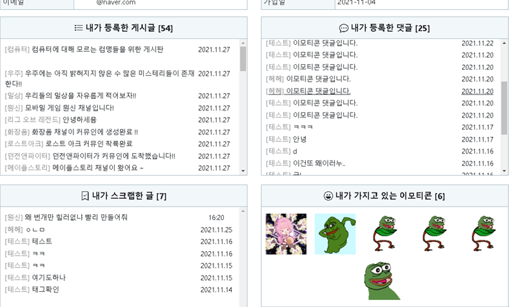

# project-commuin
* 졸업 프로젝트
* 커뮤니티 사이트

## 개발 환경
* VS Code,&nbsp; Eclipse

## 기술
* Bootstrap,&nbsp; JQuery,&nbsp; Ajax
* Java ( Spring Legacy ),&nbsp; MyBatis
* MySQL

## 화면 [ 본인이 참여한 부분만 ] 

**Index, 이모티콘 구매·등록·검색, 게시글 검색, 페이징 처리, 채널생성·관리, 구독·스크랩·신고, 마이페이지**

 

*Index*

---

*Emoticon*

---

*Search*

</img>
###### 제목, 작성자, 제목+작성자, 추천·조회 등 검색
</img>
###### 게시글이 태그를 가지고 있다면 태그 별 검색 가능

---

*Channel*

</img>
###### 사용자가 채널생성, 관리
</img>
###### 검색단어가 포함된 채널이름, 채널생성자에 대한 목록 출력

---

*etc*

</img>
###### 사용자가 작성한 댓글, 게시글, 구매한 이모티콘, 관심있는 게시글 스크랩
</img>
###### 관심있는 게시글 스크랩
</img>
###### 부적절한 게시글 신고 -> 관리자 페이지에서 관리 가능
</img>
###### 부적절한 게시글 신고 -> 관리자 페이지에서 관리 가능
</img>
###### 부적절한 게시글 신고 -> 관리자 페이지에서 관리 가능

